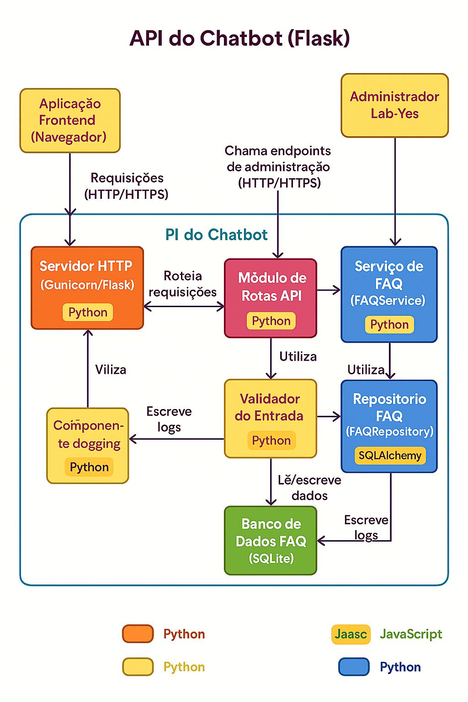

# 02 - Modelo C4 da Arquitetura do Chatbot

Este documento apresenta a arquitetura do chatbot do Lab-Yes utilizando o Modelo C4, que descreve software em diferentes níveis de abstração: Contexto do Sistema, Contêineres, Componentes e Código.

## 1. Nível 1: Diagrama de Contexto do Sistema (System Context Diagram)

O diagrama de contexto mostra o sistema que estamos construindo (o Chatbot do Lab-Yes) e como ele se encaixa em seu ambiente, identificando os usuários e os sistemas externos com os quais interage.

* **Objetivo:** Fornecer uma visão geral de alto nível do sistema, seus usuários e sistemas externos.
* **Elementos:**
    * **Pessoas:**
        * `Visitante do Site Lab-Yes`: Usuário principal que interage com o chatbot.
        * `Administrador do Lab-Yes`: Pessoa responsável por gerenciar as FAQs do chatbot (futuramente via um painel administrativo, por enquanto via API).
    * **Sistemas:**
        * `Site do Lab-Yes`: O website principal onde o chatbot será incorporado.
        * `Chatbot do Lab-Yes`: O sistema a ser construído.

* **Interações:**
    * `Visitante do Site Lab-Yes` **usa** `Site do Lab-Yes`.
    * `Visitante do Site Lab-Yes` **interage com** `Chatbot do Lab-Yes` (via interface no site).
    * `Chatbot do Lab-Yes` **é incorporado em** `Site do Lab-Yes`.
    * `Administrador do Lab-Yes` **gerencia** `Chatbot do Lab-Yes` (adiciona/edita FAQs).
       

## 2. Nível 2: Diagrama de Contêineres (Container Diagram)

O diagrama de contêineres mostra a arquitetura de alto nível do sistema, dividindo-o em "contêineres" tecnológicos (aplicações, bancos de dados, sistemas de arquivos, etc.) que rodam em processos separados e se comunicam entre si.

* **Elementos:**
    * `Visitante do Site Lab-Yes`: (Pessoa)
    * `Site do Lab-Yes`: (Sistema)
    * `Navegador do Visitante`: (Contêiner - Aplicação Frontend) - O navegador web que executa o JavaScript do chatbot.
    * `API do Chatbot (FastAPI)`: (Contêiner - Aplicação Backend) - Serviço Python/FastAPI que processa as mensagens e busca as respostas.
    * `Banco de Dados FAQ (SQLite/PostgreSQL)`: (Contêiner - Banco de Dados) - Armazena as perguntas e respostas frequentes.

* **Interações:**
    * `Visitante do Site Lab-Yes` **usa** `Navegador do Visitante`.
    * `Navegador do Visitante` **envia requisições HTTP (API)** para `API do Chatbot (FastAPI)`.
    * `API do Chatbot (FastAPI)` **lê/escreve dados** no `Banco de Dados FAQ`.
      * `Administrador do Lab-Yes` **gerencia (via API)** `API do Chatbot (FastAPI)`.
        
        *(Nota: O diagrama usa Flask como exemplo, mas a implementação atual utiliza FastAPI).*

## 3. Nível 3: Diagrama de Componentes (Component Diagram - para a API do Chatbot)

Este nível foca em uma única caixa do diagrama de contêineres (a `API do Chatbot (FastAPI)`) e a decompõe em seus principais componentes internos.

* **Elementos (dentro da API do Chatbot - FastAPI):**
    * `Visitante do Site Lab-Yes`: (Pessoa)
    * `Navegador do Visitante`: (Contêiner)
    * `Servidor Web ASGI (Uvicorn)`: (Componente) - O ponto de entrada que lida com as requisições HTTP.
    * `Módulo de Rotas API (Routers)`: (Componente) - Define os endpoints HTTP (ex: `/chat`, `/add_faq`) usando os decoradores do FastAPI.
    * `Serviço de FAQ (FAQService)`: (Componente) - Encapsula a lógica de negócio para buscar e processar FAQs.
    * `Repositório FAQ (FAQRepository)`: (Componente) - Abstrai a interação direta com o banco de dados (usando SQLAlchemy).
    * `Módulo de Validação (Pydantic)`: (Componente) - Garante que as requisições da API e os dados de resposta sigam um schema definido.
    * `Módulo de Logging`: (Componente) - Registra eventos e erros.
    * `Banco de Dados FAQ`: (Contêiner externo a este detalhe, mas interage com).

* **Interações:**
    * `Navegador do Visitante` **envia requisição HTTP** para `Servidor Web ASGI (Uvicorn)`.
    * `Servidor Web ASGI (Uvicorn)` **direciona** para `Módulo de Rotas API`.
    * `Módulo de Rotas API` **utiliza** `Módulo de Validação (Pydantic)` para validar os dados da requisição.
    * `Módulo de Rotas API` **chama** `Serviço de FAQ`.
    * `Serviço de FAQ` **utiliza** `Repositório FAQ`.
    * `Repositório FAQ` **interage com** `Banco de Dados FAQ`.
    * Todos os componentes **escrevem logs** no `Módulo de Logging`.

      
      *(Nota: O diagrama usa Flask como exemplo, mas a implementação atual utiliza FastAPI e Uvicorn).*

